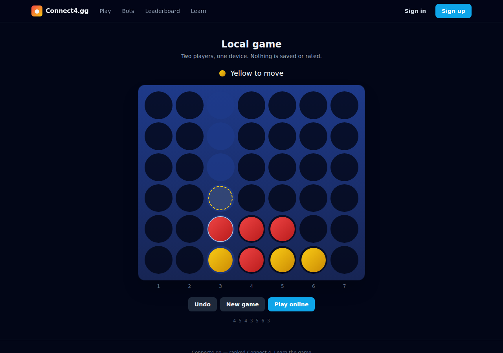

# Connect4.gg

A competitive Connect 4 platform — ranked real-time games against other players,
with ELO ratings per time control, skill-based matchmaking, bot opponents, and a
strategy curriculum.



## What's here

| Feature | Status |
| --- | --- |
| Email/password + Google OAuth accounts | ✅ |
| One-time profile setup (username, avatar, bio, country) | ✅ |
| Per-mode ELO with provisional K-factor and rating history | ✅ |
| Matchmaking with widening rating bands | ✅ |
| Direct challenges by username | ✅ |
| Blitz / Rapid / Classical / Casual time controls | ✅ |
| Server-authoritative gameplay with chess-style clocks | ✅ |
| Six bot opponents with distinct skill *and* strategy | ✅ |
| Resign, draw offers, rematch, reconnect handling | ✅ |
| Replay scrubber and spectator links | ✅ |
| Leaderboards, profiles, rating graphs, user search, follows | ✅ |
| Strategy curriculum | 🚧 scaffold — one lesson, one puzzle, [roadmap](docs/curriculum-roadmap.md) |
| Move-by-move game review with an evaluation graph | ✅ |
| Five themes, including the board and discs | ✅ |
| 80 preset avatars, with optional photo upload | ✅ |
| Username and bio screening, presets-only photos by default | ✅ |

## Stack

- **Frontend** — React 18 + TypeScript + Tailwind, built with Vite
- **Backend** — Fastify + TypeScript, Socket.IO for realtime
- **Database** — PostgreSQL via Prisma
- **Engine** — a dependency-free TypeScript package shared by both, so the
  browser and the server agree on the rules by construction
- **Storage** — local disk in dev, any S3-compatible bucket in production

## Layout

```
packages/engine/   Game rules, ELO, mode config, bots. Pure logic, no I/O.
server/            Fastify API, Socket.IO gateway, Prisma schema.
web/               React SPA.
scripts/           Bot ladder benchmark and an end-to-end smoke test.
docs/              Curriculum roadmap.
```

The engine is a real package rather than a folder of helpers: the server needs
it to validate moves authoritatively, the client needs it to render boards and
replays, and a shared package is what stops those two implementations drifting.

## Running it

### With Docker

```bash
cp .env.example .env      # edit SESSION_SECRET before anything public
docker compose up --build
```

The app is on http://localhost:5173, the API on http://localhost:4000.

### Locally

You need Node 20+ and a PostgreSQL 14+ instance.

```bash
npm install
docker compose up -d db          # or point DATABASE_URL at your own Postgres

cp .env.example server/.env      # set DATABASE_URL and SESSION_SECRET
npm run db:migrate -w @connect4gg/server
npm run db:seed -w @connect4gg/server

npm run build -w @connect4gg/engine
npm run dev -w @connect4gg/server   # :4000
npm run dev -w @connect4gg/web      # :5173
```

Vite proxies `/api` and `/socket.io` to the server in dev, so everything is
same-origin and the session cookie works without any CORS configuration.

### Google OAuth (optional)

Create OAuth credentials at the [Google Cloud
Console](https://console.cloud.google.com/apis/credentials) with the redirect
URI `http://localhost:4000/api/auth/google/callback`, then set
`GOOGLE_CLIENT_ID` and `GOOGLE_CLIENT_SECRET`. Leave them blank and the
"Continue with Google" button simply doesn't render.

## Seeing the whole site

Two ways, neither needing an account:

```bash
npm run build:demo      # one self-contained HTML file, open it in a browser
```

That builds the real app with the API and socket resolved against fixtures
instead of a server, bundled into a single file. Every page renders, every link
works, and games against the bots — including the post-game analysis — run for
real, because the engine is the same one the server uses. Only the things that
genuinely need a backend (live opponents, accounts, persistence) are stubbed.

To see it with a database behind it instead:

```bash
npm run db:demo -w @connect4gg/server
```

That seeds a cast of players, a few hundred finished games played out by the
bots, and the rating histories those games imply — enough that the home page,
leaderboards and profiles have something in them. Sign in as
`demo@demo.connect4.gg` / `connect4demo`.

## Tests

```bash
npm test                            # engine + server unit tests
npm run typecheck                   # all three workspaces
node scripts/bot-ladder.mjs 10      # verify the bot ladder still holds
node scripts/e2e-smoke.mjs          # end-to-end, needs a running server
npm run build:demo && npm run test:ui   # browser regression tests
```

- **139 unit tests.** The engine's rules, ELO maths, matchmaking bands and bot
  behaviour; the server's clocks, queue and live-game state machine.
- **`scripts/e2e-smoke.mjs`** registers two throwaway accounts and drives the
  real socket protocol: queueing, pairing, move rejection, a full game, rating
  updates, persistence, a bot game, and the auth guards.
- **`scripts/regression-ui.mjs`** drives the built demo in a real browser and
  asserts on geometry and behaviour rather than on text — that the bottom row
  renders below the top one, that discs rest on the stack beneath them, that
  clicking an opponent does not navigate out of a live game, and that the game
  you just finished can be reviewed. Each check fails only if its specific bug
  comes back. Needs `npx playwright install chromium` once.

## Design notes

**The server owns the game.** Clients send a column number and nothing else.
The server looks the game up, checks the socket's session owns a seat in it, and
validates the move against its own board. No board state is ever accepted from a
client, so a tampered client can at worst send an illegal move and have it
rejected.

**Clocks are stored, not run.** A clock is `{ balance, lastTickAt, running }`
rather than a countdown timer, so the true remaining time is always derivable
from the wall clock. That makes it safe to broadcast, cheap to snapshot, and
impossible for a client to influence. The browser extrapolates between snapshots
so the display ticks smoothly, but a local clock hitting zero never ends a game —
only the server's does.

**A disconnect pauses the clock.** Losing on time to a dropped WiFi connection
is the fastest way to make someone stop playing, so a dropped socket pauses that
player's clock and starts a 60-second grace period. Reconnecting inside it
resumes exactly where they left off.

**Bots differ in strategy, not just depth.** Each bot has an evaluation style —
weights for centre control, threat building, defence, and odd/even parity — on
top of its search depth and blunder rate. Bastion at depth 7 genuinely plays a
different game from Vex at depth 5, not just a stronger one. `scripts/bot-ladder.mjs`
verifies each bot still beats the one below it; re-run it after touching any
bot's configuration.

**Bot search runs in a worker thread.** The strongest bot searches nine plies,
which is over a second of solid CPU. On the event loop that would stall every
other socket on the server, so searches are offloaded and fall back inline if
the worker is unavailable.

**Anonymous sockets can watch but not act.** A `/watch` link is meant to be
shareable, so a socket without a session still connects — with a null identity.
It can join a room and receive broadcasts; every state-changing handler resolves
an account first. See [docs/security.md](docs/security.md) for the full review of
the auth, upload, and realtime surfaces.

**The board is never flipped.** A chess board rotates 180° so your own pieces
sit nearest you, and that works because chess pieces do not fall. Connect 4
discs do — rotating the board makes them stack upward, and mirroring the columns
puts column 1 on the right while the labels underneath still read left to right.
Which side you are on belongs in the player bars, not in the geometry of the
board.

**The board is themed, so the sides are named by turn order.** Five themes
change every colour including the board and the discs, which means "Red" and
"Yellow" are wrong under four of them. The sides are "first" and "second" —
the same reason chess names its sides by turn order rather than by how a
particular set happens to be painted.

**Photos are the one thing not screened locally.** Usernames and bios are, and
screened properly: input is Unicode-folded, homoglyphs and leetspeak mapped to
ASCII and separators stripped before matching, so `sh1t`, `s-h-i-t` and `ѕhit`
all resolve to the same thing. Images cannot be judged that way, and a
skin-tone or entropy heuristic would look like a safeguard while catching
almost nothing — so `AVATAR_UPLOADS` defaults to `presets`, which refuses
uploads outright, and `moderated` sends each image to a classifier you
configure. See [docs/security.md](docs/security.md).

**Analysis is anchored to tactical facts, not a grading curve.** The engine's
evaluation units are arbitrary weights, so a "40-point drop" would mean nothing
to a player. Instead the verdicts that matter are checkable claims — *a win was
on the board and you did not play it*, *that move let your opponent win and
another move didn't* — which is also why they hold at any search depth. Measured
across a full game, depths 4 through 8 produce a materially identical
classification, so the default is 6: about a second per game rather than
thirteen. Results are cached on the game row.

**Ratings are per mode.** Blitz strength and Classical strength are genuinely
different skills, so they are tracked separately, exactly as a chess site does.
New accounts use a K-factor of 40 for their first 30 games, then drop to 20.

## Deploying

Both services are plain Docker images and run anywhere that takes one.

**Fly.io**

```bash
fly launch --dockerfile server/Dockerfile --name connect4gg-api
fly postgres create --name connect4gg-db
fly postgres attach connect4gg-db          # sets DATABASE_URL
fly secrets set SESSION_SECRET="$(openssl rand -base64 48)" \
                CLIENT_ORIGIN="https://your-web-host"
fly deploy
```

**Railway** — create a project, add a PostgreSQL plugin, then add two services
pointing at `server/Dockerfile` and `web/Dockerfile`. Railway injects
`DATABASE_URL` automatically; set `SESSION_SECRET` and `CLIENT_ORIGIN` yourself.

Whichever host you use:

- **`SESSION_SECRET` must be a real secret.** The server refuses to start in
  production with the development default.
- **Set `CLIENT_ORIGIN`** to the browser app's URL — it drives CORS and the
  OAuth redirect.
- **Point avatars at object storage.** `STORAGE_DRIVER=local` writes to the
  container filesystem, which is ephemeral on both hosts. Set `STORAGE_DRIVER=s3`
  and the `S3_*` variables for anything real.
- **Migrations run on boot** (`prisma migrate deploy`), so a deploy never serves
  against a stale schema.
- **Live games are in memory.** A restart ends them. Fine for a single instance;
  running more than one requires a Socket.IO Redis adapter and moving game state
  out of process.

## License

MIT
